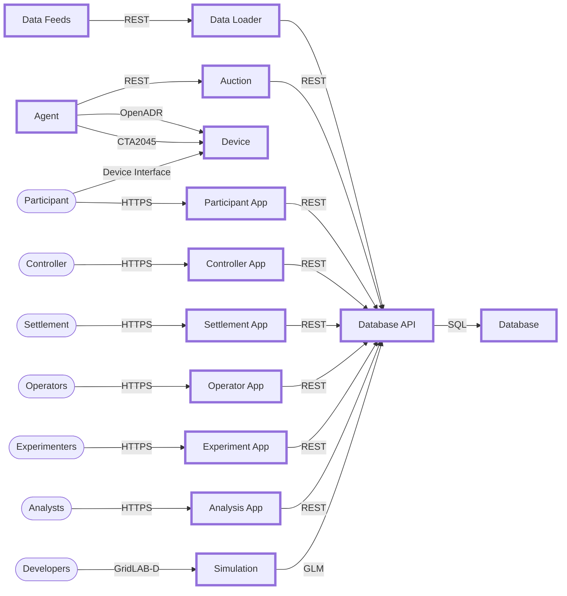

# System Architecture

```mermaid
flowchart TD
  
  classDef active stroke-width:4px;

  devices[Devices] --OpenADR/CTA2045--> agents[Agents]:::active --REST--> gateway[API Gateway]
    click agents "https://github.com/postroad-energy/design/blob/main/docs/agents.md" _blank

  datafeeds[Data Feeds] --HTTPS--> dataloader[Data Loader]:::active --REST--> gateway
    click dataloader "https://github.com/postroad-energy/design/blob/main/docs/datafeeds.md" _blank
  
  participant([Participants]) --HTTPS--> participant_app[Participant App]:::active --REST--> gateway
    click participant_app "https://github.com/postroad-energy/design/blob/main/docs/participants.md" _blank

  controllers([Controllers]) --HTTPS--> controller_app[Controller App]:::active --REST--> gateway
    click controller_app "https://github.com/postroad-energy/design/blob/main/docs/controllers.md" _blank

  settlement([Settlement]) --HTTPS--> settlement_app[Settlement App]:::active --REST--> gateway
    click settlement_app "https://github.com/postroad-energy/design/blob/main/docs/settlement.md" _blank

  operators([Operators]) --HTTPS--> operator_app[Operator App]:::active --REST--> gateway
    click operator_app "https://github.com/postroad-energy/design/blob/main/docs/operators.md" _blank

  experiment([Experimenters]) --HTTPS--> experiment_app[Experiment App]:::active --REST--> gateway
    click experiment_app "https://github.com/postroad-energy/design/blob/main/docs/experimenters.md" _blank

  analysis([Analysts]) --HTTPS--> analysis_app[Analysis App]:::active --REST--> gateway
    click analysis_app "https://github.com/postroad-energy/design/blob/main/docs/analysis.md" _blank
  
  developers([Developers]) --HTTPS--> simulation[Simulation]:::active --REST--> gateway
    click simulation "https://github.com/postroad-energy/design/blob/main/docs/simulation.md" _blank
  
  gateway --> lambda[Lambda]
  
  gateway --> sqs((SQS)) --> lambda2[Lambda]

  gateway --> sns((SNS)) --> lambda3[Lambda]

    lambda --> auction[Auction]:::active --REST--> db_api  
      click auction "https://github.com/postroad-energy/design/blob/main/docs/auction.md" _blank
      
    lambda --> orderbook[Orderbook]:::active --REST--> db_api  
      click orderbook "https://github.com/postroad-energy/design/blob/main/docs/orderbook.md" _blank
      
    lambda --> weather[Weather]:::active --REST--> db_api  
      click weather "https://github.com/postroad-energy/design/blob/main/docs/weather.md" _blank
    
    lambda --> market[Market]:::active --REST--> db_api  
      click market "https://github.com/postroad-energy/design/blob/main/docs/market.md" _blank
    
    lambda --> scada[SCADA]:::active --REST--> db_api  
      click scada "https://github.com/postroad-energy/design/blob/main/docs/scada.md" _blank
    
    lambda --> network[Network]:::active --REST--> db_api  
      click network "https://github.com/postroad-energy/design/blob/main/docs/network.md" _blank
    
    lambda --> assets[Assets]:::active --REST--> db_api  
      click assets "https://github.com/postroad-energy/design/blob/main/docs/assets.md" _blank
    
    lambda --> ami[AMI]:::active --REST--> db_api  
      click ami "https://github.com/postroad-energy/design/blob/main/docs/ami.md" _blank
    
    lambda --REST--> db_api[Database API]:::active --SQL--> database[(Database)]:::active
      click db_api "https://github.com/postroad-energy/design/blob/main/docs/database.md" _blank
      click database "https://github.com/postroad-energy/design/blob/main/docs/database.md" _blank

  gateway --> other[Other services]

  gateway --> amplify[Amplify]
  
  gateway --> s3[S3]
    s3 --> websites([Websites]):::active
      click websites "https://github.com/postroad-energy/design/blob/main/docs/websites.md" _blank
  
  gateway --> auth[Cognito]:::active
    click auth "https://github.com/postroad-energy/design/blob/main/docs/authentication.md" _blank
  
  gateway --> ec2[EC2]
    ec2 --> ebs([EBS])
    ec2 --> dns((DNS))
    ec2 --> sg((SG))
```

# Information Flow

```mermaid
flowchart LR

  classDef active stroke-width:4px;

  datafeeds[Data Feeds]:::active --REST--> dataloader[Data Loader]:::active --> database_api
    click datafeeds "https://github.com/postroad-energy/design/blob/main/docs/datafeeds.md" _blank
    click dataloader "https://github.com/postroad-energy/design/blob/main/docs/dataloader.md" _blank
    
  agent[Agent]:::active --REST--> auction[Auction]:::active
    click agent "https://github.com/postroad-energy/design/blob/main/docs/agent.md" _blank
    click auction "https://github.com/postroad-energy/design/blob/main/docs/auction.md" _blank
    
  agent --OpenADR--> device[Device]:::active
  agent --CTA2045--> device
    click device "https://github.com/postroad-energy/design/blob/main/docs/device.md" _blank
  
  participant --Device Interface--> device
  
  auction --REST--> database_api
    click database_api "https://github.com/postroad-energy/design/blob/main/docs/database.md" _blank
  
  participant([Participant]) --HTTPS--> participant_app[Participant App]:::active --REST--> database_api[Database API]:::active --SQL--> database[Database]:::active
    click participant_app "https://github.com/tess-cc/design/blob/main/docs/participants.md" _blank
    click database "https://github.com/postroad-energy/design/blob/main/docs/database.md" _blank

  controller([Controller]) --HTTPS--> controller_app[Controller App]:::active --REST--> database_api
      click controller_app "https://github.com/postroad-energy/design/blob/main/docs/controller.md" _blank

  settlement([Settlement]) --HTTPS--> settlement_app[Settlement App]:::active --REST--> database_api
      click settlement_app "https://github.com/postroad-energy/design/blob/main/docs/settlement.md" _blank

  operators([Operators]) --HTTPS--> operator_app[Operator App]:::active --REST--> database_api
      click operator_app "https://github.com/postroad-energy/design/blob/main/docs/operators.md" _blank

  experiment([Experimenters]) --HTTPS--> experiment_app[Experiment App]:::active --REST--> database_api
      click experiment_app "https://github.com/postroad-energy/design/blob/main/docs/experimenters.md" _blank

  analyst([Analysts]) --HTTPS--> analysis_app[Analysis App]:::active --REST--> database_api
    click analysis_app "https://github.com/postroad-energy/design/block/main/docs/analysis.md" _blank
    
  developer([Developers]) --GridLAB-D--> simulation[Simulation]:::active --GLM--> database_api
      click simulation "https://github.com/postroad-energy/design/blob/main/docs/simulation.md" _blank
```

# Component Design 

* [Authentication](authentication.md)

## Applications
* [Operators](operators.md)
* [Controllers](controllers.md)
* [Settlement](settlement.md)
* [Participants](participants.md)
* [Experimenters](experimenters.md)
* [Developers](simulation.md)
* [Analysts](analysis.md)

## APIs
* [Agents](agents.md)
* [Auction](auction.md)
* [Orderbook](orderbook.md)
* [Database](database.md)
* [Device](device.md)
* [Simulation](simulation.md)

## Data systems
* [Database](database.md)
* [Weather](weather.md)
* [SCADA](scada.md)
* [AMI](ami.md)
* [Network](network.md)
* [Assets](assets.md)

# Reference Documents

* Device Communications
  * [CTA-2045](https://shop.cta.tech/products/modular-communications-interface-for-energy-management)
    * [SkyCentrics](https://skycentrics.com)
  * OpenADR
    * [OpenADR Alliance](https://openadr.org/)
    * [Introduction to OpenADR 2.0](https://www.openadr.org/assets/docs/understanding%20openadr%202%200%20webinar_11_10_11_sm.pdf)
    * [OpenADR 2.0b Specification](https://cimug.ucaiug.org/Projects/CIM-OpenADR/Shared%20Documents/Source%20Documents/OpenADR%20Alliance/OpenADR_2_0b_Profile_Specification_v1.0.pdf)

