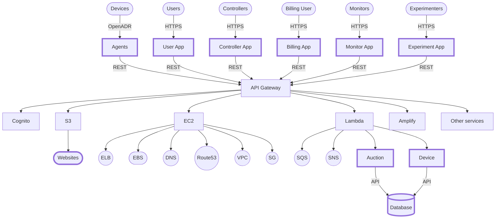

# System Architecture

# Information Flow

# Component Design 

## Applications
* [Billing](billing.md)
* [Users](users.md)
* [Controllers](controllers.md)
* [Monitors](monitors.md)
* [Experimenters](experimenters.md)

## APIs
* [Agents](agents.md)
* [Auction](auction.md)
* [Database](database.md)
* [Device](device.md)

## Data systems
* [Database](database.md)

# Reference Documents

* Device Communications
  * [CTA-2045](https://shop.cta.tech/products/modular-communications-interface-for-energy-management)
    * [SkyCentrics](https://skycentrics.com)
  * OpenADR
    * [OpenADR Alliance](https://openadr.org/)
    * [Introduction to OpenADR 2.0](https://www.openadr.org/assets/docs/understanding%20openadr%202%200%20webinar_11_10_11_sm.pdf)
    * [OpenADR 2.0b Specification](https://cimug.ucaiug.org/Projects/CIM-OpenADR/Shared%20Documents/Source%20Documents/OpenADR%20Alliance/OpenADR_2_0b_Profile_Specification_v1.0.pdf)]

