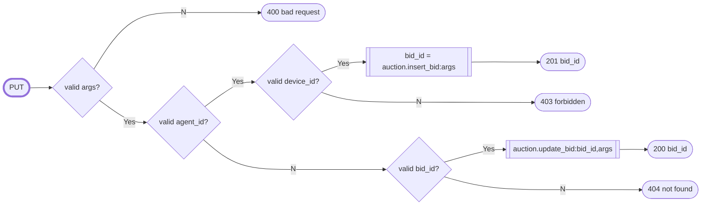

## `PUT /auction/<agent_id>`
## `PUT /auction/<bid_id>`

The auction bid `PUT` method allows the addition and modification of bid by device agents.

### Arguments

| Name | Type | Description
| ---- | ---- | -----------
| device_id | text | The device identifier
| constraint_id | text | The constraint identifier
| quantity | real | The bid quantity (in units)
| unit | text | The quantity units
| price | real | The bid price (in $/h.units)
| flexibility | integer | The device flexibility (0 for non, 1 for quantity)
| state | real | The device's current state (in units)

### Returns

| Code | Body | Descsription 
| ---- | ---- | ------------
| 200  | `{"data" : {"bid_id" : <str>}}` | The bid update was successful
| 201  | `{"data" : {"bid_id" : <str>}}` | The bid insert was successful
| 400  | `{"error" : <str>}` | The bid request was not valid
| 403  | `{"error" : <str>}` | The agent is not authorized to bid on behalf of the device
| 404  | `{"error" : <str>}` | The bid was not found |

### Logic

