# Introduction

The TESS auction is the default price-discovery mechanism for TESS and is required to provide the following capabilities.

1. Periodically compute the price at which supply equals demand.
1. Discover the price for one or more constrained quantities.

Auctions are a sequence of bid/clear/dispatch/settle events that create a market for devices to trade varying quantities of some unit.

```mermaid
gantt
   dateFormat HH:mm
   axisFormat %H:00
   title Daily market sequence with noon hour active

section Day N-...
   Settlement 1-24 (closed): done, da00, 00:00, 24:00

section Day N-1
   Settlement 1-24 (closed): done, day1, 00:00, 24:00
   
section Day N
   Settlement 1-12 (closed): done, hr0, 00:00, 12:00
   Settlement 13 (active): crit, hr13, 12:00, 13:00
   Auction 1 (closed): done, auc1, 12:00, 12:15
   Auction 2 (dispatched): crit, auc2, after auc1, 12:30
   Auction 3 (active): active, auc3, after auc2, 12:45
   Auction 4 (pending):   auc4, after auc3, 13:00
   Settlement 14-24 (pending):   hr14, 13:00, 24:00

section Day N+1
   Settlement 1-24 (pending): fut0, 00:00, 24:00

section Day N+...
   Settlement 1-24 (pending): fut1, 00:00, 24:00
```

Each auction opens after the previous auction closes and last for the configured market interval (typically 5 minutes). After the configured settlement interval, the closed markets are settled and the payments are recorded for later billing.

The sequence of events for an individual auction is illustrated by the following

The devices submit bids after the market opens. When the market closes, devices request their dispatch. The first request received results in a market clearing operation to discover the price. All dispatch requests return the clearing price and the dispatch quantity for the device. Note that the marginal device will receive a quantity less than its bid. Dispatched units will receive a quantity equal to their bids. Devices that are not dispatched will receive a quantity zero.  If more than one device bid the clearing price, then the marginal unit is chosen based on the order in which the bids are received with earlier bids receiving high precedence in the dispatch order.

# Definitions

* **Agent**: The entity responsible for submitting Bids and executing Dispatch controls.
* **Auction**: The collection of Bids received in a Market Interval.
* **Bid**: The entry in the Auction made by an Agent on behalf of a Device.
* **Clearing**: The result of processing all the Bids in the Auction
* **Clearing Time**: The time at which the Clearing begins.
* **Constraint Device**: The Device which imposes a supply constraint, if any, e.g., the feeder.
* **Device**: The physical equipment associated with a Bid
* **Dispatch**: The effect of a Device having a Price "in the money" of an Auction.
* **Flexibility**: Determines whether a device can operated below the Bid Quantity when it is a Marginal Unit.
* **Market Id**: The market identifier, i.e., the closing time modulo the Market Interval
* **Market Interval**: The time interval over which the Auction Clearing is performed.
* **Marginal Unit**: A Device that has a Dispatch Quantity less than its Bid Quantity. It is also the Device that sets the Price.
* **Price**: The cost per unit of Quantity per hour at which a Device will Dispatch.
* **Price Cap**: The highest price accepted by the Auction.
* **Price Floor**: The lowest price accepted by the Auction.
* **Quantity**:	The non-zero amount at which a Device will Dispatch.

# Auction Rules

In order for a database operation to be successfully completed, the following rules must be applied.

## Bid Rules

1. Only an Agent shall be permitted to submit or update a Bid
   1. An Agent shall not be permitted to submit a Bid for a Device it cannot control.
   1. The response to a valid Bid shall be an Bid Id.
1. An Agent must specify the Constrained Device(s) under which the Device is operating.
1. A Bid that includes an Bid Id shall update the Bid with the same Bid Id.
   1. An updated Bid shall be ignored if it is received after the Market Clearing process is started.
1. An Agent may withdraw a Bid any time before the Auction closes.
1. A Bid Quantity must be non-zero
   1. A Bid which has a negative Quantity shall be processed as a Supply Bid
   1. A Bid which has a positive Quantity shall be processed as a Demand Bid
   1. A Bid which has a zero or missing Quantity shall result in an error response. 
1. A Bid shall include the Status (i.e., the current measured Quantity) of the device at the time the Bid is submitted.
1. A Bid Price less than the Price Floor or greater than the Price Cap shall be rejected.
   1. The price resolution for power quantities shall be 1.0x10-4 $/MWh, i.e., 1 hour maximum time, 100MW maximum quantity, and $0.01 minimum cost.
   1. The price resolution for energy quantities shall be 1.0x10-8 $/MWh^2, i.e., 100 hours maximum time, 10GWh maximum quantity, and $0.01 minimum cost.

## Clearing Rules

1. The utility's Agent shall submit a single Unresponsive Demand Bid for each Constrained Device with no price immediately prior to market clearing.
   1. The Unresponsive Demand Bid shall be the total of current measured load for the Constrained Device less the total Quantity for all Devices under it.
1. The Auction shall be closed when the Clearing Time is reached. 
   1. The Clearing Time shall be when the Unix timestamp in seconds since midnight 1 January 1970 UTC modulo the Auction Clearing Interval in seconds is equal to zero.
   1. Bids received after the Auction is closed shall be posted to the next Auction.
1. The Clearing Price shall be the price at which the Supply Quantity exactly equals the Demand Quantity. 
   1. The Clearing Price shall be between the Price Cap and the Price Floor, inclusive.
   1. If the total unresponsive demand exceeds the total supply, the Clearing Price shall be the Price Cap.
   1. If the Clearing Quantity is a range, then the Clearing Quantity shall be the maximum of the range.
   1. If the Clearing Price is a range, then the Clearing Price shall be the midpoint of the range.

## Dispatch Rules

1. The Clearing Price shall be available less than 1 second after the Clearing Time.
1. An Agent shall obtain the Clearing Price after the Clearing Time is reached.
   1. If an Agent fails to obtain the Clearing Price, then each Device for which the Agent submitted Bids shall be deemed to have failed Dispatch if “in the money”.
   1. A Demand Device shall be deemed dispatched if the Clearing Price is less than or equal to its Demand Bid Price and its Agent has obtained the Clearing Price.
   1. A Supply Device shall be deemed dispatched if the Clearing Price is greater than or equal to its Supply Bid Price and its Agent has obtained the Clearing Price.
   1. An Agent shall dispatch a Device immediately union receipt of the Clearing Price.

## Settlement Rules

1. Agents shall pay for all operations as metered by the device.
   1. The metered cost shall be at the Clearing Price when dispatched.
1. Devices shall Dispatch in accordance with its Agent's Bid.
   1. A Device that fails to Dispatch in accordance its Agent's Bid shall pay a Penalty equal to the resulting lost surplus.
      1. The Penalty shall be waived for the Marginal Unit.
      1. The Penalty payment shall be distributed to the Dispatched devices in proportion to the surpluses received at the original Clearing Price, not counting the Device(s) paying the penalty.

# Auction Data Tables

The following data tables are used by the auction subsystem.

## Bids

The `bids` table collects all the bid data for each auction.

| Name | Type | Description
| ---- | ---- | -----------
| bid_id | text | The bid identifier
| market_id | integer | The market id sequence number
| received_at | real | The timestamp at which the bid was recorded
| device_id | text | The device identifier
| constraint_id | text | The constraint identifier
| quantity | real | The bid quantity (in units)
| unit | text | The quantity units
| price | real | The bid price (in $/h.units)
| flexibility | integer | The device flexibility (0 for non, 1 for quantity)
| state | real | The device's current state (in units)

## Agents

The `agents` table collects all the agent data for each device.

| Name | Type | Description
| ---- | ---- | -----------
| agent_id | text | The agent identifier
| user_id  | text | The user who owns the agent
| valid_at | real | The timeat which this record goes into effect

## Dispatch

The `dispatch` table collects all the market clearing results for each bid.

| Name | Type | Description
| ---- | ---- | -----------
| bid_id | text | The bid for this dispatch
| quantity | real | The quantity dispatched
| unit | text | The unit of quantity dispatched
| price | real | The price at which the quantity is dispatched
| duration | real | The duration of the dispatch in seconds

## Ledger

The `ledger` table collects all the market settlement data for each auction.

| Name | Type | Description
| ---- | ---- | -----------
| bid_id | text | The bid for this dispatch
| meter | real | The cumulative quantity dispatched
| unit | text | The unit of the cumulative quantity
| cost | real | The payment for this settled bid

# Data Validation

Data validation rules shall be enforced when data is being added the database or when the database is validated.

## Bids

1. The `bid_id` shall be a globally unique id string.
2. The `market_id` shall be the Unix timestamp of the market closing time modulo the market clearing interval, rounded up.
3. The `received_at` timestamp modulo the market clearing interval, rounded up, shall equal the `market_id`.
4. The `constraint_id` device shall have the device type `CD` or be NULL if the `device_id` equal `CD`.
5. The `device_id` shall be one of the configured device types, or `CD` if the `constraint_id` is NULL.
6. The `quantity` shall be non-zero.
7. The `quantity` shall be between the minimum and maximum quantities configured for the `device_id`.
8. The `unit` shall be one of the configured units for the auction.
9. The `price` shall be between the minimum and maximum prices configure for the auction.
10. The flexibility shall be either `0` or `1`.
11. The `state` shall be between the minimum and maximum quantities configured for the `device_id`.

## Agents

1. The `agent_id` shall be globally unique
2. The `user_id` shall be exist in the user table
3. The `valid_at` value shall be unique for this agent
4. The `valid_at` value shall be less than or equal to the current timestamp.

## Dispatch

1. The `bid_id` shall exist in the bids table.
2. The `quantity` shall be between 0 and the quantity of the bid in the bids table, inclusive.
3. The unit shall be the same as in the bids table.
4. If the quantity is non-zero, then price shall be less than or equal to the bid price if the bid quantity is positive, or greather than or equal to the bid price if the bid quantity is negative.
5. If the quantity is zero, then price shall be less than or equal to the bid price if the bid quantity is negative, or greather than or equal to the bid price if the bid quantity is positive.
6. The duration shall be equal to market interval configured for the unit.

## Ledger

1. The `bid_id` shall exist in the bids table.
2. The `unit` shall be the bid unit divided by 1 hour.
3. The `cost` shall equal the `meter` value multiplied by the dispatch price.
4. The sum of all `cost` values in each settlement interval shall equal zero.

# Auction API

The auction subsystem implements the following API.

All agents must authenticate using an API token. This token is used to both verify the identity of the agent and the validity of the request made.  For example, when an agent uses GET to obtain data about a device, the agent must use a valid token to verify its identity. The agent id is then used to verify that the agent is authorized to control the device in the request.

## `GET /auction/<bid_id>`

The auction bid `GET` method allows reading of bids by device agents.

### Returns

| Code | Body | Descsription 
| ---- | ---- | ------------
| 200  | `{"data" : {"bid_id" : "<bid_id>", "market_id" : <market_id>, "received_at" : <timestamp>, "device_id" : "<device_id>", "constraint_id" : <device_id>, "quantity" : <quantity>, "unit" : "<unit>", "price" : <price>, "state" : <quantity>, "flexibility" : <flexibility>}}` | The bid data was found ok
| 403  | `{"error" : "<agent_id> not authorized for <device_id>"}` | The agent is not authorized to bid on behalf of the device
| 404  | `{"error" : "<bid_id> invalid"}` | The bid was not found 

### Logic

## `PUT /auction/<device_id>?<args>`
## `PUT /auction/<bid_id>?<args>`

The auction bid `PUT` method allows the addition and modification of bids by device agents.

### Arguments

| Name | Type | Description
| ---- | ---- | -----------
| device_id | text | The device identifier
| constraint_id | text | The constraint identifier
| quantity | real | The bid quantity (in units)
| unit | text | The quantity units
| price | real | The bid price (in $/h.units)
| flexibility | integer | The device flexibility (0 for non, 1 for quantity)
| state | real | The device's current state (in units)

### Returns

| Code | Body | Descsription 
| ---- | ---- | ------------
| 200  | `{"data" : {"bid_id" : "<bid_id>"}}` | The bid update was successful
| 201  | `{"data" : {"bid_id" : "<bid_id>"}}` | The bid insert was successful
| 400  | `{"error" : "<name>=<value> invalid"}` | A request parameter was not valid
| 403  | `{"error" : "<agent_id> not authorized for <device_id>"}` | The agent is not authorized to bid on behalf of the device
| 404  | `{"error" : "<bid_id> invalid"}` | The bid was not found

### Logic

## `DELETE /auction/<bid_id>`

The auction bid `DELETE` method allows withdrawwal of bids by device agents.

### Returns

| Code | Body | Descsription 
| ---- | ---- | ------------
| 200  | None | The bid data was deleted ok
| 403  | `{"error" : "<agent_id> not authorized for <device_id>"}` | The agent is not authorized to bid on behalf of the device
| 404  | `{"error" : "<bid_id> invalid"}` | The bid was not found 
| 409  | `{"error" : "<bid_id> is not pending"}` | The bid is not pending in the current market

### Logic

# Dispatch API

## `GET /dispatch/<bid_id>`

The dispatch bid `GET` method allows reading of dispatch by device agents.

### Returns

| Code | Body | Descsription 
| ---- | ---- | ------------
| 200  | `{"data" : {"device_id" : "<device_id>", "quantity" : <quantity>, "unit" : "<unit>", "price" : <price>, "duration" : <duration>}}` | The dispatch data was found ok
| 403  | `{"error" : "<agent_id> not authorized for <device_id>"}` | The agent is not authorized to bid on behalf of the device
| 404  | `{"error" : "<bid_id> invalid"}` | The bid was not found 

### Logic

# Settle API

## `PUT /settle/<bid_id>?<args>`

The dispatch bid `PUT` method allows submitted of metering by device agents.

### Arguments

| Name | Type | Description
| ---- | ---- | -----------
| bid_id | text | The bid for this dispatch
| meter | real | The cumulative quantity dispatched
| unit | text | The unit of the cumulative quantity
| cost | real | The payment for this settled bid

### Returns

| Code | Body | Descsription 
| ---- | ---- | ------------
| 201  | `{"data" : {"bid_id" : "<bid_id>"}}` | The ledger insert was successful
| 400  | `{"error" : "<name>=<value> invalid"}` | A request parameter was not valid
| 403  | `{"error" : "<agent_id> not authorized for <device_id>"}` | The agent is not authorized to bid on behalf of the device
| 404  | `{"error" : "<bid_id> invalid"}` | The bid was not found

### Logic

