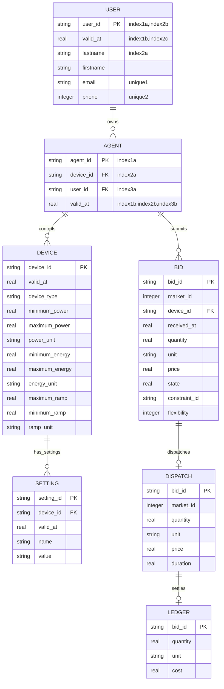

```mermaid
erDiagram

  USER {
    string user_id PK "index1a,index2b"
    real valid_at "index1b,index2c"
    string lastname "index2a"
    string firstname
    string email "unique1"
    integer phone "unique2"
  }
  USER ||--o{ AGENT : owns

  AGENT {
    string agent_id PK "index1a"
    string device_id FK "index2a"
    string user_id FK "index3a"
    real valid_at "index1b,index2b,index3b"
  }
  
  DEVICE {
    string device_id PK
    real valid_at
    string device_type
    real minimum_power
    real maximum_power
    string power_unit
    real minimum_energy
    real maximum_energy
    string energy_unit
    real maximum_ramp
    real minimum_ramp
    string ramp_unit
  }
  AGENT ||--o{ DEVICE : controls
  
  SETTING {
    string setting_id PK
    string device_id FK
    real valid_at
    string name
    string value
  }
  DEVICE ||--o{ SETTING : has_settings
  
  
  BID {
    string bid_id PK
    integer market_id
    string device_id FK
    real received_at
    real quantity
    string unit
    real price
    real state
    string constraint_id
    integer flexibility
  }
  AGENT ||--o{ BID : submits
  
  DISPATCH {
    string bid_id PK
    integer market_id
    real quantity
    string unit
    real price
    real duration
  }
  BID ||--o| DISPATCH : dispatches
  
  LEDGER {
    string bid_id PK
    real quantity
    string unit
    real cost
  }
  DISPATCH ||--o| LEDGER : settles
  
```
