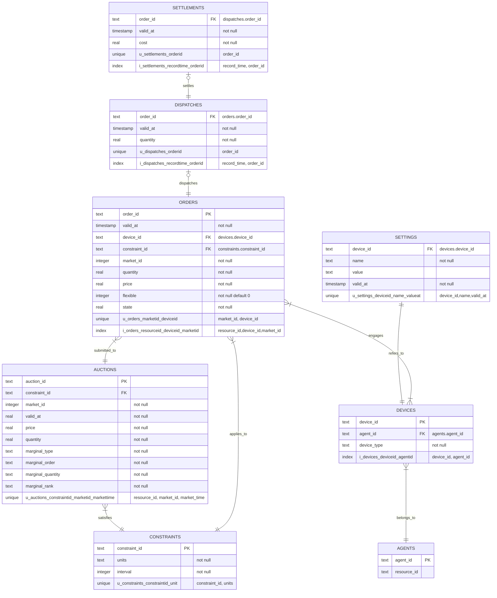

```mermaid
erDiagram

  CONSTRAINTS {
    text constraint_id PK
    text units "not null"
    integer interval "not null"
    unique u_constraints_constraintid_unit "constraint_id, units"
  }
  
  AUCTIONS {
    text auction_id PK
    text constraint_id FK
    integer market_id "not null"
    real valid_at "not null"
    real price "not null"
    real quantity "not null"
    text marginal_type "not null"
    text marginal_order "not null"
    text marginal_quantity "not null"
    text marginal_rank "not null"
    unique u_auctions_constraintid_marketid_markettime "resource_id, market_id, market_time"
  }
  AUCTIONS }|--|| CONSTRAINTS : satisfies
  
  AGENTS {
    text agent_id PK
    text resource_id
  }
  
  DEVICES {
    text device_id PK
    text agent_id FK "agents.agent_id"
    text device_type "not null"
    index i_devices_deviceid_agentid "device_id, agent_id"
  }
  DEVICES }|--|| AGENTS : belongs_to
  
  SETTINGS {
    text device_id FK "devices.device_id"
    text name "not null"
    text value
    timestamp valid_at "not null"
    unique u_settings_deviceid_name_valueat "device_id,name,valid_at"
  }
  SETTINGS ||--|| DEVICES : refers_to

  ORDERS {
    text order_id PK
    timestamp valid_at "not null"
    text device_id FK "devices.device_id"
    text constraint_id FK "constraints.constraint_id"
    integer market_id "not null"
    real quantity "not null"
    real price "not null"
    integer flexible "not null default 0"
    real state "not null"
    unique u_orders_marketid_deviceid "market_id, device_id"
    index i_orders_resourceid_deviceid_marketid "resource_id,device_id,market_id"
  }
  ORDERS }|--|| CONSTRAINTS : applies_to
  ORDERS }|--|{ DEVICES : engages
  ORDERS }|--|| AUCTIONS: submitted_to
  
  DISPATCHES {
    text order_id FK "orders.order_id"
    timestamp valid_at "not null"
    real quantity "not null"
    unique u_dispatches_orderid "order_id"
    index i_dispatches_recordtime_orderid "record_time, order_id"
  }
  DISPATCHES |o--|| ORDERS : dispatches
  
  SETTLEMENTS {
    text order_id FK "dispatches.order_id"
    timestamp valid_at "not null"
    real cost "not null"
    unique u_settlements_orderid "order_id"
    index i_settlements_recordtime_orderid "record_time, order_id"
  }
  SETTLEMENTS |o--|| DISPATCHES: settles
```
