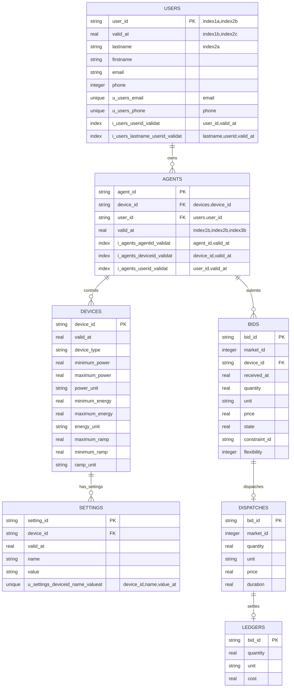

```mermaid
erDiagram

  USERS {
    string user_id PK "index1a,index2b"
    real valid_at "index1b,index2c"
    string lastname "index2a"
    string firstname
    string email
    integer phone
    unique u_users_email "email"
    unique u_users_phone "phone"
    index i_users_userid_validat "user_id,valid_at"
    index i_users_lastname_userid_validat "lastname,userid,valid_at"
  }
  USERS ||--o{ AGENTS : owns

  AGENTS {
    string agent_id PK 
    string device_id FK "devices.device_id"
    string user_id FK "users.user_id"
    real valid_at "index1b,index2b,index3b"
    index i_agents_agentid_validat "agent_id,valid_at"
    index i_agents_deviceid_validat "device_id,valid_at"
    index i_agents_userid_validat "user_id,valid_at"
  }
  
  DEVICES {
    string device_id PK
    real valid_at
    string device_type
    real minimum_power
    real maximum_power
    string power_unit
    real minimum_energy
    real maximum_energy
    string energy_unit
    real maximum_ramp
    real minimum_ramp
    string ramp_unit
  }
  AGENTS ||--o{ DEVICES : controls
  
  SETTINGS {
    string setting_id PK
    string device_id FK
    real valid_at
    string name
    string value
    unique u_settings_deviceid_name_valueat "device_id,name,value_at"
  }
  DEVICES ||--o{ SETTINGS : has_settings
  
  
  BIDS {
    string bid_id PK
    integer market_id
    string device_id FK
    real received_at
    real quantity
    string unit
    real price
    real state
    string constraint_id
    integer flexibility
  }
  AGENTS ||--o{ BIDS : submits
  
  DISPATCHES {
    string bid_id PK
    integer market_id
    real quantity
    string unit
    real price
    real duration
  }
  BIDS ||--o| DISPATCHES : dispatches
  
  LEDGERS {
    string bid_id PK
    real quantity
    string unit
    real cost
  }
  DISPATCHES ||--o| LEDGERS : settles
  
```
