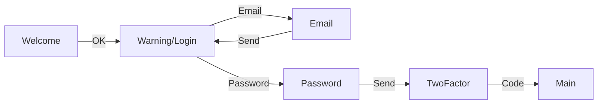
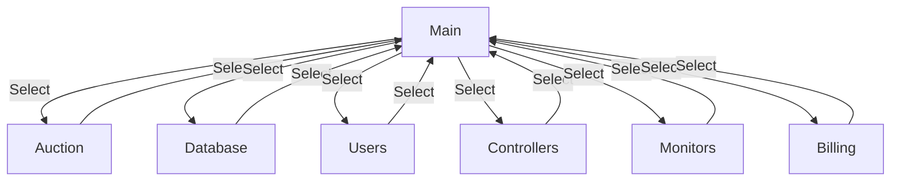
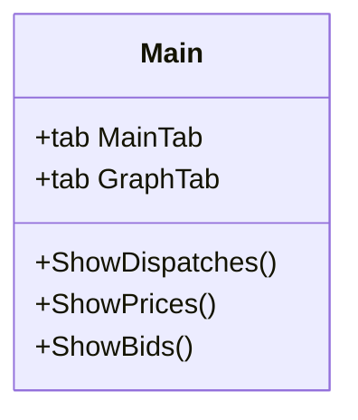
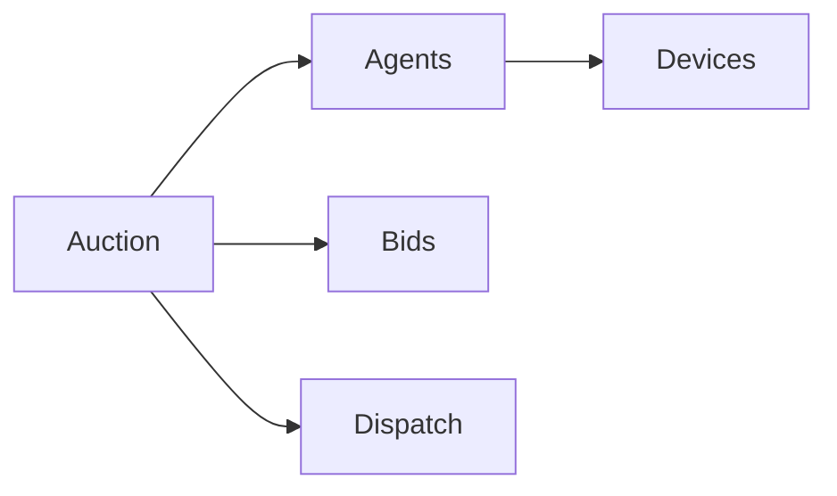

The purpose of the monitor application is to provide the TESS system technical support staff the ability to monitor the status and repair the TESS system during operations.

# User Page Flow

## Authentication

## Main

## Auction

