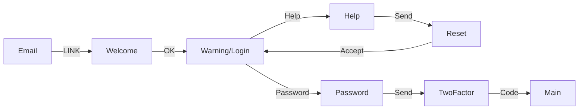
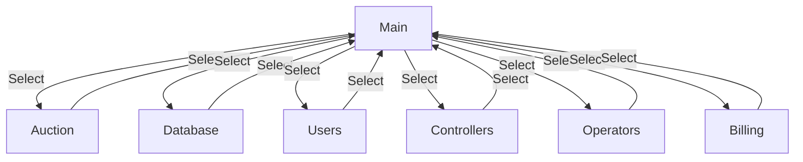
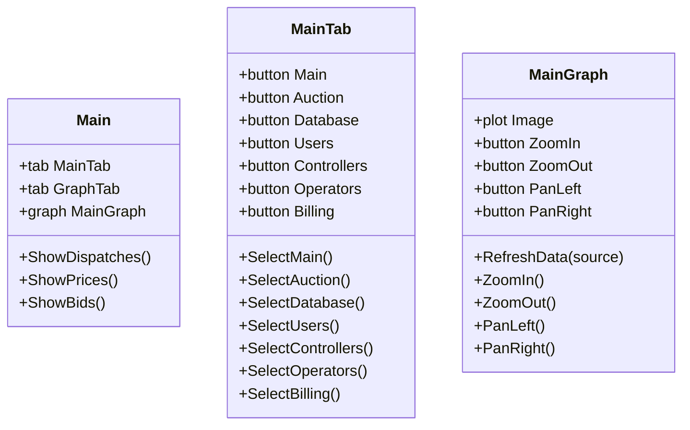
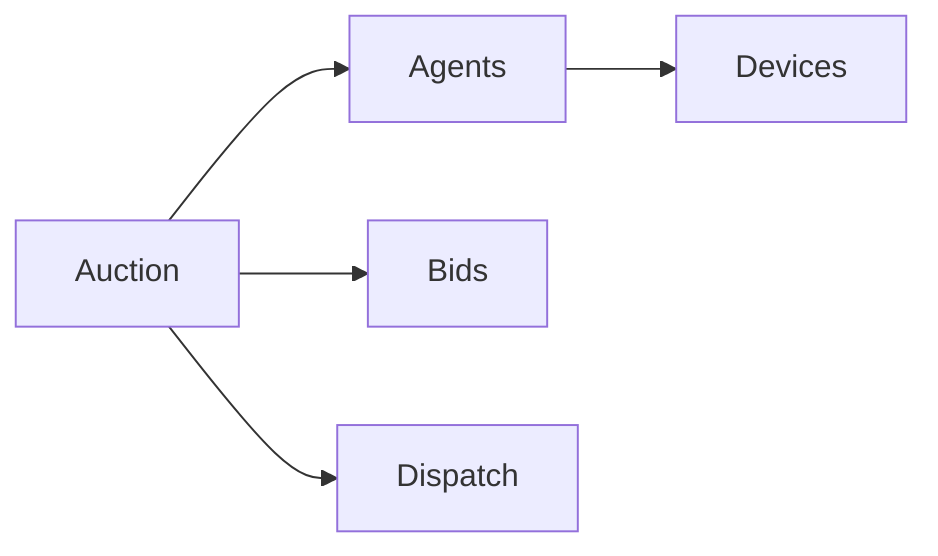

The purpose of the operators application is to provide the TESS system technical support staff the ability to monitor the status and repair the TESS system during operations.

# User Page Flow

See [Page layouts](https://docs.google.com/presentation/d/1VtxWEh3BZM9dYI3MDHqG4p__TPV337L0yp4-b1spSNk) for mockups.

## Authentication

## Main

## Auction

