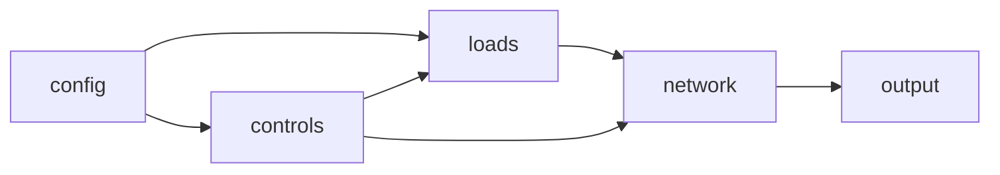

# Simulation Design 

## File List 

Required files
* config.csv 
  - name of utility 
  - relevant settings pertained to utility
* network (CYME)
  - convert CYME2GLM
  - associate groupids with SCADA objects 
* loads.glm
  - AMI vs Realtime
* market.glm 
  - Orderbook vs auction logic 
  - module market
* output.glm
  - default output: SCADA (SWING, cap banks, regulators)
  - correlated from group_id
  
Optional files
* analytics.glm
* diagnostics.glm
  - billing.csv 
  - powerdump.csv
  - voltagedump.csv
  - currentdump.csv
* billing.glm 

## Simulation Flow 

