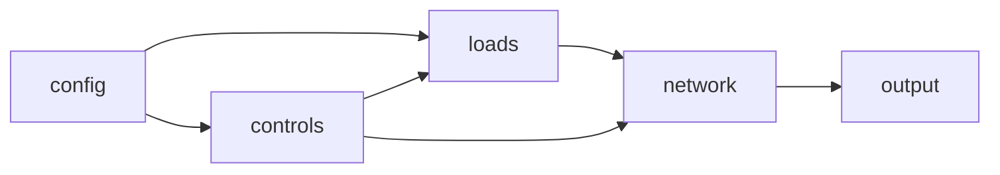

# Simulation Design 

## File List 

* config.csv 
* controls.py 
* network.glm 
* loads.glm
* output.glm
* postprocess.py
* output/ 
  - billing.csv 
  - powerdump.csv
  - voltagedump.csv
  - currentdump.csv

## Simulation Flow 

