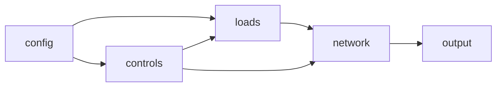

# Simulation Design 

The design of the simulation is modular: options are decided by either including or dis-including optional files or by the contents of the files themselves. High level configuration file defines the utility name. 

## File List 

Main: `main.sh`

Required files
* `config.csv` 
  - name of utility 
  - relevant settings pertained to utility
* `network`.xx (CYME)
  - convert CYME2GLM
  - associate groupids with SCADA objects 
* `loads.glm`
  - AMI vs Realtime
* `market.glm` 
  - Orderbook vs auction logic 
  - module market
* `output.glm`
  - default output: SCADA (SWING, cap banks, regulators)
  - correlated from group_id
  
Optional files
* `analytics.glm`
* `diagnostics.glm`
  - billing.csv 
  - powerdump.csv
  - voltagedump.csv
  - currentdump.csv
* `billing.glm` 

## Simulation Flow 

```mermaid 
flowchart LR 

  classDef active stroke-width:4px;
  
  config--> loads --> network-->output
  config --> controls --> network
  controls --> loads
```

# Database API

This API specification support the requirements for the simulation. See https://github.com/postroad-energy/simulation/blob/main/gridlabd/database.py for details.

## `PUT /settlements/<order_id>?cost=<cost>`

SQL:
~~~
replace into settlements (record_time, order_id, cost) 
values ('{record_time}','{order_id}',{cost});
~~~         

## `PUT /settings?object=<object>&name=<name>&value=<value>`

SQL:
~~~
insert into settings (setting_id,object,name,value_at,value) 
values ({guid()},'{object}','{name}','{now()}','{value}');
~~~

Returns: `setting_id`

## `PUT /agents/<agent_id>?resource_id=<resource_id>`

SQL:
~~~
insert into agents (agent_id,resource_id) 
values ('{guid()}','{resource_id}');
~~~

Return: `agent_id`

## `PUT /markets/<resource_id>?units=<units>&interval=<interval>`

SQL:
~~~
insert into markets (resource_id, units, interval)
values ('{resource_id}','{units}',{interval});
~~~

## `PUT /auctions?market_id=<market_id>&market_time=<market_time>&resource_id=<resource_id>&price=<price>&quantity=<quantity>&marginal_type=<marginal_type>&marginal_order=<marginal_order>&marginal_quantity=<marginal_quantity>&marginal_rank=<marginal_rank>`

SQL:
~~~
insert into auctions (auction_id,market_id,market_time,resource_id,price,quantity,marginal_type,marginal_order,marginal_quantity,marginal_rank)
values ('{auction_id}','{market_id}','{market_time}','{resource_id}',{price},{quantity},'{marginal_type}','{marginal_order}',{marginal_quantity},{marginal_rank});
~~~

Returns: `auction_id`

## `PUT /devices?agent_id=<agent_id>&device_type=<device_type>`

SQL:
~~~
insert into devices
(device_id, agent_id, device_type)
values
('{device_id}','{agent_id}','{device_type}');
~~~

Returns: `device_id`

## `PUT /dispatches/<order_id>?quantity=<quantity>`

SQL:
~~~
insert into dispatches 
(record_time, order_id, quantity) 
values 
('{now()}','{order_id}',{quantity});
~~~

## `PUT /orders?device_id=<device_id>&resource_id=<resource_id>&market_id=<market_id>&quantity=<quantity>&price=<price>&flexible=<flexible>&state=<state>`

SQL:
~~~
replace into orders
(record_time,order_id,device_id,resource_id,market_id,quantity,price,flexible,state)
values
('{now()}','{guid()}','{device_id}','{resource_id}','{market_id}',{quantity},{price},{flexible},{state});
~~~

Returns: `order_id`

## `PUT /orders/<order_id>?device_id=<device_id>&resource_id=<resource_id>&market_id=<market_id>&quantity=<quantity>&price=<price>&flexible=<flexible>&state=<state>`

SQL:
~~~
replace into orders
(record_time,order_id,device_id,resource_id,market_id,quantity,price,flexible,state)
values
('{now()}','{order_id}','{device_id}','{resource_id}','{market_id}',{quantity},{price},{flexible},{state});
~~~

## `GET /settings/<group>/name=<name>`

SQL:
~~~
select value 
from settings
where class = '{group}' and name = '{name}'
order by value_at desc
limit 1;
~~~

Returns: `value`

## `GET /markets`

SQL:
~~~
select resource_id, units, interval 
from markets;
~~~

Returns: list of select row values

## `GET /auctions?market_id=<market_id>`

SQL:
~~~
select market_time, resource_id, quantity, price, auction_id 
from auctions 
where market_id = {market_id} 
order by resource_id;
~~~

Returns: list of select row values

## `GET /orders_count?market_id=<market_id>?device_type=<device_type>`

SQL:
~~~
select count(order_id), resource_id 
from orders 
join devices on orders.device_id = devices.device_id 
where market_id = {market_id} and device_type = '{device_type}'
group by resource_id;
~~~

Returns: list of seleted row values

## `GET /table_count/<table>`

SQL:
~~~
select count(*) 
from {table};
~~~

Returns: (int)

## `GET /settlements_total`

SQL:
~~~
select sum(cost) 
from settlements;
~~~

Returns: (float)

## `GET /settlements`

SQL:
~~~
select device_id, sum(cost) 
from settlements join orders on settlements.order_id = orders.order_id
group by device_id;
~~~

Returns: list of select row values

## `GET /settlements/<device_id>`

SQL:
~~~
select sum(cost) 
from settlements join orders on settlements.order_id = orders.order_id
where by device_id = {device_id};
~~~

Returns: list of select row values
