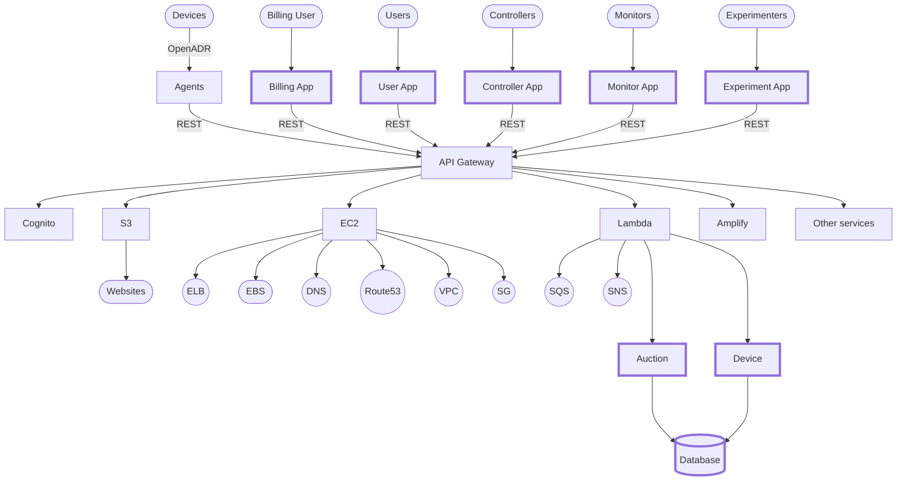

# Component Design 

## Applications
* [Billing](billing.md)
* [Users](users.md)
* [Controllers](controllers.md)
* [Monitors](monitors.md)
* [Experimenters](experimenters.md)

## APIs
* [Auction](auction.md)
* [Device](device.md)

## Data storage
* [Database](database.md)

