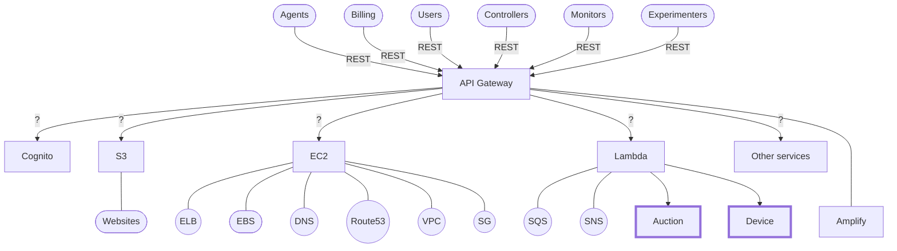

```mermaid
flowchart TD
  
  classDef active stroke-width:4px;
  
  agents([Agents]) -- REST --> gateway[API Gateway]
  billing([Billing]) -- REST --> gateway
  users([Users]) -- REST --> gateway
  controllers([Controllers]) -- REST --> gateway
  monitors([Monitors]) -- REST --> gateway
  experiment([Experimenters]) -- REST --> gateway
  
  gateway -- ? --> auth[Cognito]
  
  gateway -- ? --> s3[S3]
    s3 --- www([Websites])
  
  gateway -- ? --> ec2[EC2]
    ec2 --- elb((ELB))
    ec2 --- ebs([EBS])
    ec2 --- dns((DNS))
    ec2 --- route53((Route53))
    ec2 --- vpc((VPC))
    ec2 --- sg((SG))
  
  gateway -- ? --> lambda[Lambda]
    lambda --- sqs((SQS))
    lambda --- sns((SNS))
    lambda --> auction[Auction]:::active
    click auction "https://github.com/tess-v2/design/blob/master/docs/auction.md" _blank
    lambda --> device[Device]:::active
    click auction "https://github.com/tess-v2/design/blob/master/docs/device.md" _blank
  
  gateway ---- amplify[Amplify]
  
  gateway -- ? --> other[Other services]
  
```

## Component Design 

* [Auction](auction.md)
* [Device](device.md)
